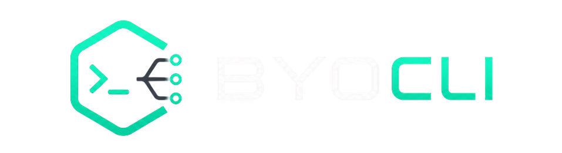

<div align="center">



# BYOCLI

**Bring Your Own CLI — a CLI-agnostic desktop coding workspace.**

Run any AI coding agent (Claude Code, Codex, Gemini, Aider, Goose, OpenCode…) side-by-side with a live browser and your project files, in one focused desktop shell.

[](LICENSE)
[](https://tauri.app)
[](https://www.typescriptlang.org/)
[](https://www.rust-lang.org/)
[](#contributing)

[Features](#-features) · [Screenshots](#-screenshots) · [Install](#-install) · [Build from source](#-build-from-source) · [Architecture](#-architecture) · [Roadmap](#-roadmap) · [Contributing](#-contributing)

</div>

---

## ✨ Why BYOCLI?

Every AI coding agent is great at *something*. BYOCLI doesn't pick one — it gives you a single, persistent workspace where your favorite CLIs run in isolated tabs, share a live browser view of what they're building, and let you point at exactly what needs fixing.

> _"Stop pasting screenshots into a terminal. Point at the thing."_ 

### The core ideas

- **Bring your own CLI.** No vendor lock-in. BYOCLI ships sensible defaults for the popular agent CLIs, but you can add any command-line tool as a profile. Claude, Codex, Gemini, Aider, Goose, Oh My Pi, OpenCode — or your own.
- **Workspace-scoped.** Each workspace is a real folder on disk with its own terminals, browser tabs, and automation history. Switch projects without losing your place.
- **Point, don't paste.** The browser pane isn't just for previewing — click "Annotate", point at any DOM element, describe what should change, and BYOCLI pastes a structured instruction (selector, XPath, bounding box, nearby text) straight into your active agent session.
- **Schedule the boring stuff.** A built-in scheduler runs commands on interval, daily, weekly, or cron schedules — in a workspace or a file-free temp sandbox — with overlap policies, timeouts, retries, and full run history with captured output.

---

## 🚀 Features

### Terminal
- One **xterm.js** instance per session, each backed by a real OS PTY (`portable-pty`).
- **Auto-detection** of agent CLIs — type `claude`, `codex`, etc. and the tab switches profile automatically.
- **Native session restore** — agent CLIs that support `--continue` / `--resume` reattach to their own history on restart.
- Bracketed-paste annotations into the active session.

### Browser split
- Native OS webview (WebView2 / WKWebView / WebKitGTK) running **alongside** your terminals, not in a separate window.
- Multi-tab, address-bar navigation, back/forward/reload, DevTools.
- **Visual annotations** — hover to highlight, click to capture. Selector, XPath, text, and bounds are formatted into an instruction you send to the agent.

### Files
- Read-only recursive directory tree with a 500-entry safety cap per folder.
- Symlinks that escape the workspace are silently skipped (sandbox hardening).
- Refresh on demand; lazy folder expansion.

### Automations
- Schedule commands with **interval**, **daily**, **weekly**, or **5-field cron** (validated inline).
- Run in a **workspace** or a **temp sandbox** (file-free, OS-managed cleanup).
- Overlap policies: skip · queue · terminate · parallel.
- Per-run timeout, retry count, and full output capture — last 150 runs retained.
- Stop any running automation from the UI (clean kill, no false "failed" status).

### Persistence & reliability
- Single SQLite database (`app_data_dir/byocli.sqlite3`, WAL mode).
- Debounced save coalescing — busy terminals don't thrash the database.
- Clean shutdown: child processes are drained on quit (no orphaned ConPTYs).
- Startup reconciliation reclaims orphaned backend sessions after a crash or reload.
- Terminal output is treated as **killed** (not failed) when you stop it — no spurious retries.

### Security
- Workspace path sandboxing on every directory read.
- Strict CSP on the main window; remote content is isolated to child webviews.
- Capability-scoped Tauri permissions.

---

## 📸 Screenshots

> _Add screenshots here once you have a polished set. Drop PNGs into `docs/screenshots/` and reference them like:_

<!-- 
### The workspace


### Visual annotation


### Automations

-->

_Screenshots coming soon._

---

## 💾 Install

### Windows (recommended)

Download the latest **NSIS installer** (`BYOCLI_x.y.z_x64-setup.exe`) from the [Releases](../../releases) page and run it. BYOCLI installs to your user profile — no admin required for the per-user scope.

An **MSI** is also published for enterprise/GPO deployment.

### macOS & Linux

Pre-built binaries aren't published yet (the project is Windows-first). See [Build from source](#-build-from-source) — Tauri supports all three platforms, and there's a [cross-platform handoff guide](docs/MACOS_CROSS_PLATFORM_HANDOFF.md) for macOS contributors.

---

## 🔨 Build from source

### Prerequisites

| Tool | Version | Notes |
|---|---|---|
| [Node.js](https://nodejs.org) | 20+ | LTS recommended |
| [Rust](https://rustup.rs) | stable | `rustup default stable` |
| Platform deps | — | See the [Tauri 2 prerequisites](https://v2.tauri.app/start/prerequisites/) |

**Windows:** [WebView2](https://developer.microsoft.com/microsoft-edge/webview2/) is preinstalled on Windows 10/11; [Microsoft C++ Build Tools](https://visualstudio.microsoft.com/visual-cpp-build-tools/) if you don't have them.

**macOS:** Xcode Command Line Tools (`xcode-select --install`).

**Linux:** `webkit2gtk`, `libgtk-3`, `libayatana-appindicator3-dev`, and friends — see the Tauri docs.

### Build & run

```bash
git clone https://github.com/be9hop/byocli.git
cd byocli
npm install
npm run tauri dev      # hot-reload dev build
```

For the React shell only (no Rust backend — useful for UI work):

```bash
npm run dev
```

### Test

```bash
npm test               # vitest — 40+ frontend tests
npm run test:coverage  # v8 coverage report
cd src-tauri && cargo test   # Rust unit tests (sandbox, path canonicalization)
```

### Produce an installer

```bash
npm run tauri build    # outputs NSIS + MSI into src-tauri/target/release/bundle/
```

---

## 🏗️ Architecture

BYOCLI is a **Tauri 2** app: a React 19 + Vite + TypeScript frontend running in the main webview, talking to a Rust backend over Tauri's IPC.

```
┌──────────────── Frontend (React 19 · Vite · xterm.js) ───────────────┐
│  App.tsx — single source of truth (AppState), all effects & refs     │
│   ├── Sidebar · TerminalPane · BrowserPane · FileTreePane            │
│   ├── AutomationsView (scheduler UI + run history)                   │
│   └── lib/ — platform.ts (IPC seam) · automations.ts · defaults.ts   │
└───────────────────────────────▲──────────────────────────────────────┘
        invoke() 18 commands    │    listen() 4 events
                                 │
┌────────────────────────────────┴─────────────────────────────────────┐
│  Backend (Rust · single src-tauri/src/lib.rs)                        │
│   ├── TerminalState  → portable-pty, reader thread → emit output/exit│
│   ├── DatabaseState  → rusqlite (WAL), key/value app_state           │
│   ├── Browser webview mgmt → child webviews + annotation injection   │
│   ├── Scheduler thread → emit "automation-tick" every 15s            │
│   └── System tray (hide-to-tray)                                     │
└──────────────────────────────────────────────────────────────────────┘
        │ spawns               │ reads/writes        │ add_child
        ▼                      ▼                     ▼
   PowerShell PTYs        byocli.sqlite3      child browser webviews
```

**Key design notes:**
- The entire backend is one flat `lib.rs` (~950 lines) — no module tree. Concerns are organized by code sections.
- State on the frontend lives in `App.tsx` (no Redux/Zustand). The IPC layer (`lib/platform.ts`) is the single seam between React and Rust, with a non-Tauri `localStorage` fallback for browser dev mode.
- The scheduler is **split**: Rust emits a 15s heartbeat; all real scheduling logic (cron resolution, overlap policy, retries) runs client-side in `lib/automations.ts`.
- See the [project architecture diagram](docs/architecture/byocli-project-map.png) for the full map.

---

## 🧱 Tech stack

| Layer | Choice |
|---|---|
| Shell | [Tauri 2](https://tauri.app) |
| Frontend | React 19, TypeScript 5.7, Vite 6 |
| Terminal | [@xterm/xterm](https://github.com/xtermjs/xterm.js) + fit/web-links addons |
| Backend | Rust (stable), single-file `lib.rs` |
| PTY | [portable-pty](https://crates.io/crates/portable-pty) |
| Database | [rusqlite](https://crates.io/crates/rusqlite) (SQLite, WAL, bundled) |
| Icons | [lucide-react](https://lucide.dev) |

---

## 🗺️ Roadmap

- [ ] Pre-built installers for macOS (universal) and Linux (.deb / .AppImage)
- [ ] Per-workspace saved scrollback restoration (beyond agent `--resume`)
- [ ] Annotation library — reuse captured selectors across runs
- [ ] Automation triggers beyond schedule (file watch, webhook)
- [ ] Plugin API for custom terminal profiles
- [ ] Telemetry-offline export of run history

Have an idea? [Open a discussion](../../discussions) or an issue.

---

## 🤝 Contributing

Contributions are welcome and appreciated. BYOCLI is a small, focused codebase — easy to get oriented.

1. Fork & clone the repo.
2. `npm install && npm run tauri dev` to get a working dev build.
3. Make your change on a branch. Add tests where reasonable — the pure-function modules (`lib/automations.ts`, `lib/defaults.ts`) are fully unit-testable.
4. Run `npm test` and `cd src-tauri && cargo test` before pushing.
5. Open a PR describing **what** changed and **why**.

### Areas that especially need help

- **macOS & Linux packaging.** The app is Windows-first; the cross-platform story needs contributors with those machines.
- **Accessibility audit.** Keyboard navigation, screen-reader labels, focus management.
- **Agent profile presets.** New agent CLIs ship constantly — PRs adding sensible defaults to `lib/defaults.ts` are an easy, high-value contribution.

Please read [`docs/MACOS_CROSS_PLATFORM_HANDOFF.md`](docs/MACOS_CROSS_PLATFORM_HANDOFF.md) if you're picking up macOS work.

---

## 📄 License

BYOCLI is licensed under the **[GNU General Public License v3.0](LICENSE)**.

In short: you're free to use, study, modify, and redistribute BYOCLI. **Any derivative work you distribute must also be open-sourced under the GPL-3.0 and include the source.** This keeps BYOCLI and everything built on it permanently open. See the [full license](LICENSE) for the precise terms.

---

## 💛 Acknowledgements

Built on the shoulders of giants:
- [Tauri](https://tauri.app) — the secure, fast, tiny app framework
- [xterm.js](https://github.com/xtermjs/xterm.js) — the terminal frontend
- [portable-pty](https://crates.io/crates/portable-pty) — cross-platform PTY for Rust
- Every AI coding agent community for building the tools BYOCLI hosts

<div align="center">

_Made with focus, not frenzy._

</div>
